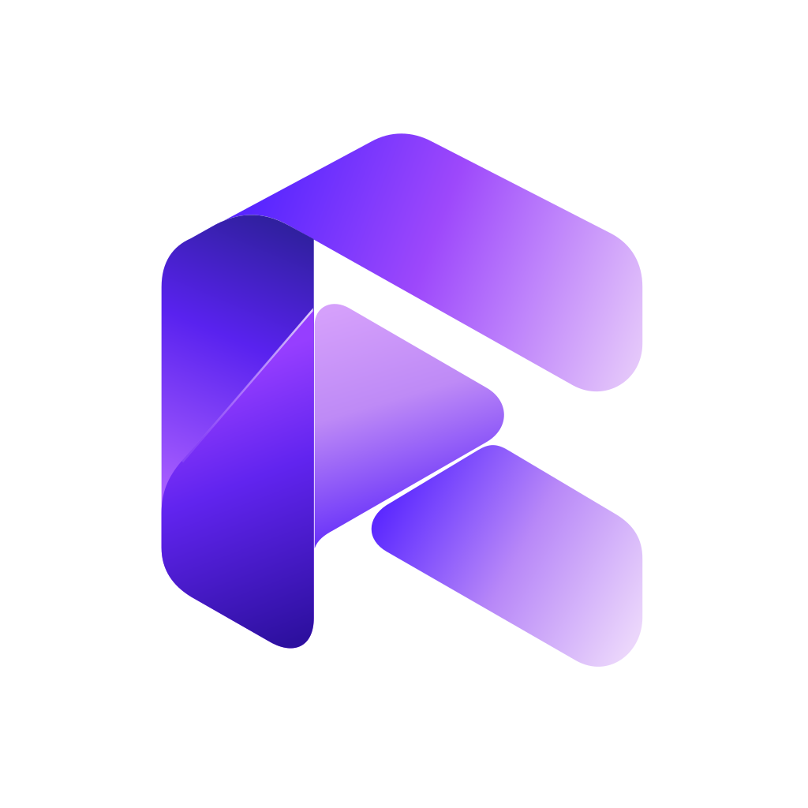

<p align="center">
  
</p>

# RigOne

**A native macOS control room for coding agents.** Define an agent once, place it on a canvas,
connect the steps, and run the graph against a project on your Mac — Claude Code and Codex as
first-class peers, in parallel, with checks RigOne runs itself.

[Download for macOS](https://github.com/monoone-dev/rig-one-landing-page/releases/latest) ·
[Website](https://monoone-dev.github.io/rig-one-landing-page/) ·
[Documentation](https://monoone-dev.github.io/rig-one-landing-page/docs/) ·
[Changelog](https://monoone-dev.github.io/rig-one-landing-page/changelog/) ·
[Support](#support)

macOS 13+ · Apple Silicon · signed and notarized · free

## Contents

- [This repository](#this-repository)
- [What RigOne does](#what-rigone-does)
- [Install](#install)
- [Built to fail honestly](#built-to-fail-honestly)
- [Where your data lives](#where-your-data-lives)
- [Updating, and coming from Loadout](#updating-and-coming-from-loadout)
- [Uninstall](#uninstall)
- [Working on the website](#working-on-the-website)
- [Support](#support)
- [Authors and license](#authors-and-license)

## This repository

RigOne's public home. The app's source code is not public and is not here.

| Path | What it is |
| --- | --- |
| [Releases](https://github.com/monoone-dev/rig-one-landing-page/releases) | The signed, notarized DMG of every release, with its notes and `SHA256SUMS.txt` |
| [`release-notes/`](release-notes/) | The same release notes, as Markdown — the website's changelog is built from them |
| [`docs/user-guide.md`](docs/user-guide.md) | The documentation — the website's docs page is built from it |
| [`app/`](app/), [`i18n/`](i18n/), [`modules/`](modules/), [`public/`](public/), [`server/`](server/) | The website — Nuxt, statically generated |
| [Issues](https://github.com/monoone-dev/rig-one-landing-page/issues) | Bug reports, ideas and questions |

## What RigOne does

1. **Write an agent** — one job, one instruction. Pick Claude Code or Codex, the model, the effort
   and what it may touch: file access from *look only* upwards, web access, a timeout, tool
   servers and skills.
2. **Put agents in a row** — that row is a workflow, saved as a graph. An arrow means "runs
   after"; steps that do not depend on each other run at the same time. A step can be an agent, a
   check or a checkpoint where you decide.
3. **Run it and watch** — point the graph at a folder on your Mac, set how many agents may work at
   once and the most the run may spend. The plan reads on the left, what every agent said on the
   right, and the question that stopped the run is pinned where you will answer it.

Each step works in its own copy of your code. When the run ends, what the agents changed waits on
its own branch in your project: **nothing is pushed, and nothing reaches your own branch until you
take it.** When a step finishes, RigOne runs the checks itself instead of asking the agent whether
it worked; a second opinion from the other vendor can raise concerns, but never approve.

Also included: project-scoped knowledge (notes you approve and skills), named context sets from
text, Markdown, images and PDFs, a shared versioned plan across steps, a Lab that drafts test
cases from your own code to evaluate an agent, Linear triggers, and run evidence — receipts,
handoffs, full answers and a diagnostic bundle — that outlives the terminal.

The full feature list is on the [website](https://monoone-dev.github.io/rig-one-landing-page/features/),
and how RigOne compares with other ways to run coding agents is
[here](https://monoone-dev.github.io/rig-one-landing-page/compare/).

## Install

You need a Mac with Apple Silicon and macOS 13 or later, and at least one agent CLI installed and
signed in: **Claude Code** or **Codex**. Runs use your own plan with each vendor.

1. Download `RigOne_<version>_aarch64.dmg` from the
   [latest release](https://github.com/monoone-dev/rig-one-landing-page/releases/latest).
2. Open the DMG and drag **RigOne** into **Applications**.
3. Open it from Applications.

The disk image and the application inside it are signed with Apple Developer ID, notarized and
stapled. If macOS says the app "cannot be opened" or "is damaged", don't work around it: delete
the file, download it again, and [open an issue](https://github.com/monoone-dev/rig-one-landing-page/issues/new)
if it happens again.

<details>
<summary>Verify a download (optional)</summary>

```bash
shasum -a 256 ~/Downloads/RigOne_<version>_aarch64.dmg
spctl --assess --type open --context context:primary-signature -v ~/Downloads/RigOne_<version>_aarch64.dmg
```

The checksum must match the one in the release notes (each release also carries
`SHA256SUMS.txt` — run `shasum -a 256 -c SHA256SUMS.txt` in the download folder). `spctl` must
answer `accepted` and `source=Notarized Developer ID`.

</details>

**Permissions.** macOS asks for each one the first time it is needed: the folders you work in,
sending events to other applications, and the microphone if a workflow drives an app that records.
Details: [Getting started](https://monoone-dev.github.io/rig-one-landing-page/docs/#getting-started).

## Built to fail honestly

RigOne treats orchestration failures as product failures, not terminal noise:

| RigOne refuses to… | Instead |
| --- | --- |
| Start two steps that write to overlapping places | Refuses before the first process starts |
| Leave processes behind after Stop or a timeout | Ends the whole process group, then verifies it is dead |
| Put prompts or secrets on a command line | Sends them through stdin; child environments are rebuilt from an allowlist |
| Crash on a vendor event it does not know | Records it and carries on |
| Count a green exit code as a pass when no tests ran | Shows "nothing ran" as its own outcome |
| Treat its database as the truth | Keeps files as the truth; the SQLite index can be deleted and rebuilt |

RigOne itself runs on your Mac and works in your folders. The agents it starts are Claude Code and
Codex, so what they read goes to their providers exactly as when you run them in a terminal. More:
[Safety model](https://monoone-dev.github.io/rig-one-landing-page/docs/#safety-model).

## Where your data lives

| What | Where |
| --- | --- |
| Your library: agents, workflows, skills, notes, triggers, context sets, settings | `~/.rig-one/` |
| A project's own notes and its run history (plain files, safe to commit) | `.rig-one/` inside the project folder |
| The work of a run | A branch in your project's own Git repository |

## Updating, and coming from Loadout

RigOne does not install updates by itself: download the new DMG from the
[latest release](https://github.com/monoone-dev/rig-one-landing-page/releases/latest) and replace
the app. Your library and project folders stay put.

Loadout is the earlier name of RigOne. Version 1.1.0 moves `~/.loadout` to `~/.rig-one` on first
launch, and each project's `.loadout/` to `.rig-one/` when you open it. macOS sees RigOne as a new
app, so permissions start over; delete the old **Loadout.app** once your library has arrived.
Details: [1.1.0 release notes](release-notes/v1.1.0.md).

## Uninstall

1. Quit RigOne and move `/Applications/RigOne.app` to the Trash. Your library stays.
2. To remove your data too, delete `~/.rig-one/` and the `.rig-one/` folders inside your projects —
   **this permanently deletes your agents, workflows, notes and run history.** Branches that runs
   left in your repositories are ordinary Git branches; delete them with Git.

## Working on the website

The website is a [Nuxt](https://nuxt.com) 4 app in TypeScript with [Nuxt UI](https://ui.nuxt.com),
[Nuxt i18n](https://i18n.nuxtjs.org) and SCSS, generated to static HTML so every word is in the
served markup. It is published in English (`/`), Polish (`/pl/`), Spanish (`/es/`), Italian
(`/it/`), French (`/fr/`), Portuguese (`/pt/`), German (`/de/`), Simplified Chinese (`/zh/`) and
Japanese (`/ja/`); the first visit follows the browser's language and the choice is kept in a
first-party cookie. The colour mode follows the system until the visitor picks one. Same stack and
same structure as [`index-one-landing-page`](https://github.com/monoone-dev/index-one-landing-page),
so the MonoOne sites stay one family.

```bash
pnpm install
pnpm dev          # http://localhost:3000
pnpm typecheck
pnpm generate     # static output in .output/public
```

| Path | What it holds |
| --- | --- |
| `i18n/content/` | All page copy, one typed file per language (`en.ts` is the source; `types.ts` keeps the others complete) |
| `app/data/` | What doesn't get translated: links, icons, the comparison's yes/no values |
| `app/components/` | One component per section; `RigMark.vue` is the logo |
| `app/pages/` | Home, features, docs, compare and changelog |
| `app/assets/scss/` | Fonts, colour tokens (light and dark), base and Markdown styles |
| `app/composables/usePageSeo.ts` | Meta tags, Open Graph and JSON-LD; `hreflang` and canonical come from Nuxt i18n |
| `modules/markdown.ts` | Renders `docs/user-guide.md` and `release-notes/*.md` into the pages at build time |
| `server/routes/` | `sitemap.xml` (every language as an alternate) and `robots.txt` |
| `public/` | Static files served as they are: favicon, app icons, Open Graph image, web manifest |

The site makes no third-party requests: fonts and icons are bundled, and there is no analytics.
CI ([`ci.yml`](.github/workflows/ci.yml)) typechecks and builds the site and checks branch names,
commits and PR titles; [`pages.yml`](.github/workflows/pages.yml) deploys `main` to GitHub Pages
and sets `NUXT_APP_BASE_URL` to the Pages sub-path, so the site works both at
`monoone-dev.github.io/rig-one-landing-page/` and at a custom domain later. `pnpm install` also
wires git hooks that check branch names and commit messages
([Conventional Commits](https://www.conventionalcommits.org/en/v1.0.0/), no AI attribution).
Runbooks for people and coding agents are in [`AGENTS.md`](AGENTS.md) and `.agents/skills/`.

**A release** adds `release-notes/v<version>.md` — a `# Title` line, then `*Released on YYYY-MM-DD.*`,
then the notes — and the GitHub release with the DMG and `SHA256SUMS.txt`. The changelog page, the
"version is out" badge, the sitemap and the structured data pick up the new version on the next
deploy.

## Support

- **Docs first:** [the documentation](https://monoone-dev.github.io/rig-one-landing-page/docs/).
- **Bug or idea:** [open an issue](https://github.com/monoone-dev/rig-one-landing-page/issues/new)
  with your RigOne version, macOS version and what you expected.
- **Security issue:** don't put the details in a public issue. Open an issue that only says you have
  a security report, and a maintainer will arrange a private channel.

> Issues are public. Never paste API keys, private code or prompts, and don't attach the diagnostic
> bundle before reading it — it can contain file paths that include your macOS user name.

## Authors and license

<a href="https://monoone.dev"></a>
RigOne is made by **[MonoOne](https://monoone.dev)** ([GitHub](https://github.com/monoone-dev)),
the same house as [IndexOne](https://github.com/monoone-dev/index-one-landing-page).

- This repository — the website, the documentation and the release notes — is licensed under the
  [GNU AGPL-3.0](LICENSE), the same licence as the application.
- Fonts in `app/assets/fonts/` are under the SIL Open Font License 1.1; each family's licence sits
  next to it.
- The RigOne name and logo belong to MonoOne.

This section describes the licensing; it is not legal advice.
